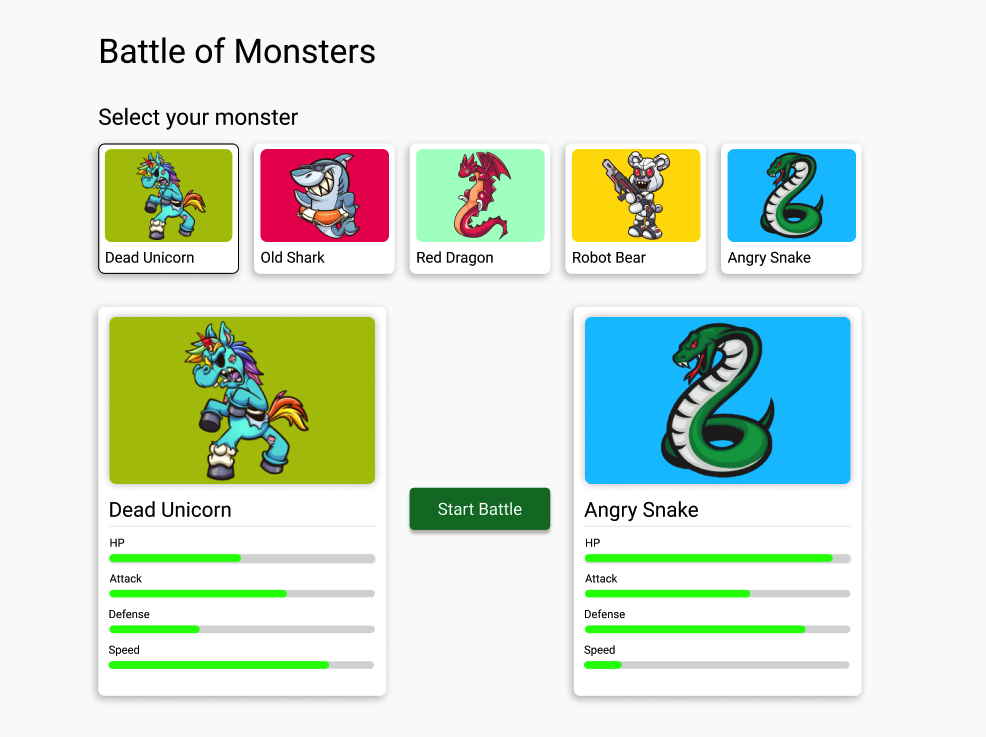

# Monster Battle Angular Project

Welcome to the Monster Battle Angular project! This project is a simple demonstration of a monster battle game implemented in Angular, featuring Jest for testing and a custom state management service.



## Table of Contents

- [Installation](#installation)
- [Usage](#usage)
- [Testing](#testing)
- [State Management Service](#state-management-service)
## Installation

To install and run this project locally, follow these steps:

1. Clone the repository:

   ```bash
   git clone https://github.com/luisvent/monster-battle-angular.git
   ```
### Testing
This project utilizes Jest for testing. To run the tests, execute the following command:   

   ```bash
   npm test
   ```
This will run all the tests in the project and provide feedback on their success or failure.


 ### State Management Service

The StateManagementService in this project handles the management of the game state. It provides methods to interact with the state such as setting and getting the selected monster, retrieving all monsters, and initializing the game state.

Methods

init(): Initializes the game state by fetching all monsters from the MonstersService.

setSelectedMonster(monster: Monster | null): Sets the currently selected monster. If null is provided, deselects the current monster.

setMonsters(monsters: Monster[]): Sets the array of monsters in the game state.

getMonsters(): Returns the array of monsters currently stored in the state.

getSelectedMonster(): Returns the currently selected monster.

getSelectedMonsterId(): Returns the ID of the currently selected monster.
